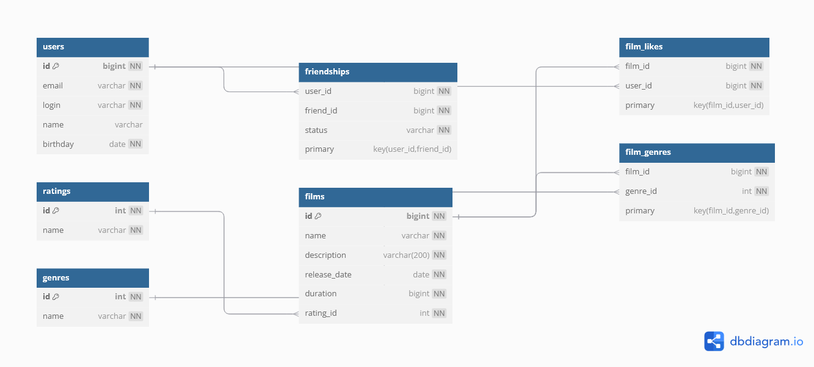

## ER-диаграмма базы данных

##  Примеры SQL-запросов
SELECT f.id, f.name, COUNT(fl.user_id) AS like_count
FROM films f
LEFT JOIN film_likes AS fl ON f.id = fl.film_id
GROUP BY f.id
ORDER BY like_count DESC
LIMIT 5;

##  Примеры запросов где одинаковый статус дружбы
SELECT f1.friend_id
FROM friendships AS f1
JOIN friendships f2 AS ON f1.friend_id = f2.friend_id
WHERE f1.user_id = 1 AND f2.user_id = 2
AND f1.status = 'CONFIRMED' AND f2.status = 'CONFIRMED';